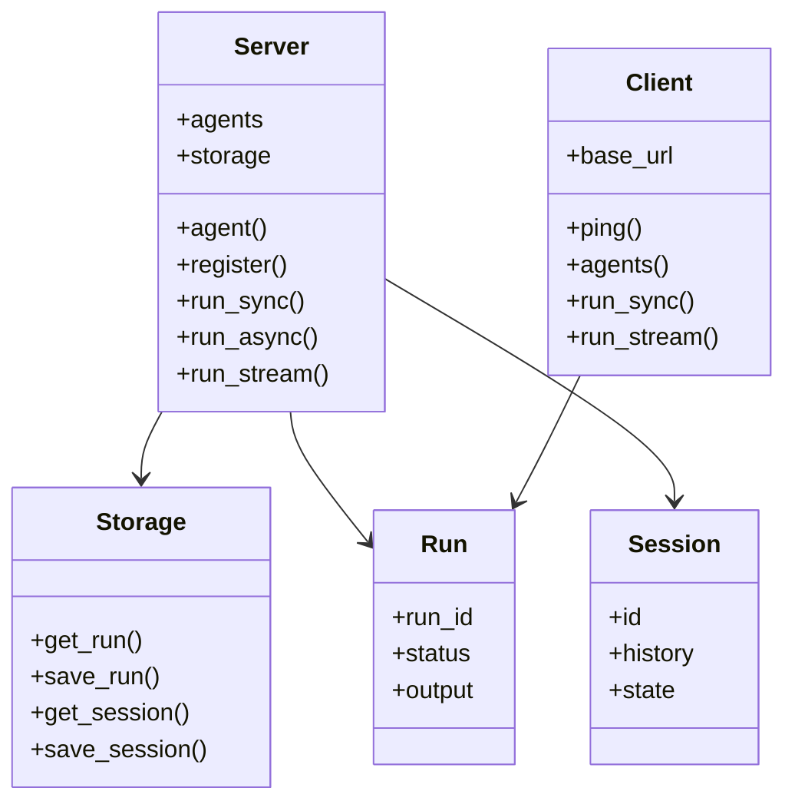

# API Reference

Complete API documentation for SimpleAcp classes and modules.

## Overview

SimpleAcp is organized into these main namespaces:

```
SimpleAcp
├── Server
│   ├── Base          # Main server class
│   ├── App           # Roda HTTP application
│   ├── Context       # Execution context
│   └── Agent         # Agent wrapper
├── Client
│   ├── Base          # HTTP client
│   └── SSE           # SSE parsing
├── Models
│   ├── Message       # Messages
│   ├── MessagePart   # Message content
│   ├── Run           # Run execution
│   ├── Session       # Sessions
│   ├── Events        # Event types
│   └── ...           # Other models
└── Storage
    ├── Base          # Abstract interface
    ├── Memory        # In-memory storage
    ├── Redis         # Redis storage
    └── PostgreSQL    # PostgreSQL storage
```

## Quick Links

<div class="grid cards" markdown>

-   :material-server:{ .lg .middle } **Server::Base**

    ---

    Main server class for hosting agents

    [:octicons-arrow-right-24: Server::Base](server-base.md)

-   :material-web:{ .lg .middle } **Client::Base**

    ---

    HTTP client for ACP servers

    [:octicons-arrow-right-24: Client::Base](client-base.md)

-   :material-cube:{ .lg .middle } **Models**

    ---

    Data models for messages, runs, sessions

    [:octicons-arrow-right-24: Models](models.md)

-   :material-database:{ .lg .middle } **Storage**

    ---

    Storage backend interface

    [:octicons-arrow-right-24: Storage](storage.md)

</div>

## Configuration

### Global Configuration

```ruby
SimpleAcp.configure do |config|
  config.logger = Logger.new(STDOUT)
end
```

### Exception Classes

```ruby
SimpleAcp::Error           # Base exception class
SimpleAcp::ConfigError     # Configuration errors
SimpleAcp::ValidationError # Input validation errors
```

## Constants

```ruby
SimpleAcp::VERSION  # Gem version string
```

## Module Methods

### SimpleAcp.configure

Configure global settings.

```ruby
SimpleAcp.configure do |config|
  # Configuration options
end
```

## Architecture



## Detailed Documentation

- [Server::Base](server-base.md) - Server class API
- [Client::Base](client-base.md) - Client class API
- [Models](models.md) - All model classes
- [Storage](storage.md) - Storage interface
