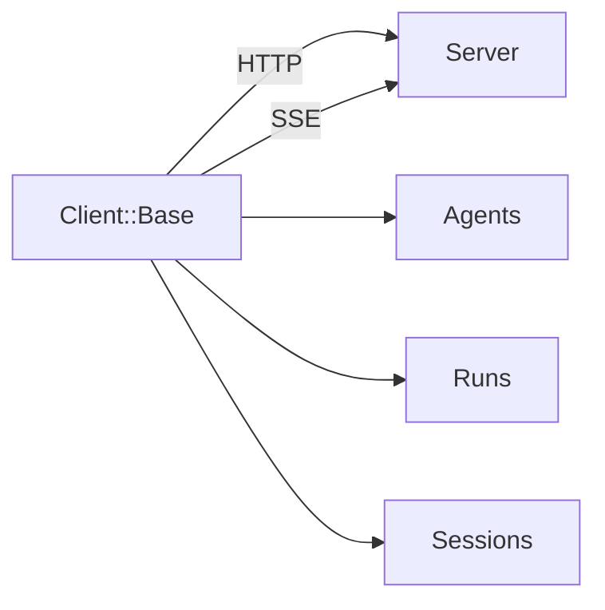

# Client Guide

The SimpleAcp client provides a clean interface for communicating with ACP servers over HTTP.

## Overview



## Quick Start

```ruby
require 'simple_acp'

client = SimpleAcp::Client::Base.new(base_url: "http://localhost:8000")

# Check connection
puts client.ping ? "Connected!" : "Failed"

# List agents
agents = client.agents
puts agents.agents.map(&:name)

# Run an agent
run = client.run_sync(
  agent: "echo",
  input: [SimpleAcp::Models::Message.user("Hello!")]
)
puts run.output.first.text_content
```

## In This Section

<div class="grid cards" markdown>

-   :material-sync:{ .lg .middle } **Sync & Async**

    ---

    Learn about synchronous and asynchronous execution

    [:octicons-arrow-right-24: Sync & Async](sync-async.md)

-   :material-play-speed:{ .lg .middle } **Streaming**

    ---

    Handle real-time streaming responses

    [:octicons-arrow-right-24: Streaming](streaming.md)

-   :material-history:{ .lg .middle } **Session Management**

    ---

    Maintain state across interactions

    [:octicons-arrow-right-24: Sessions](sessions.md)

</div>

## Client Configuration

### Basic Setup

```ruby
client = SimpleAcp::Client::Base.new(
  base_url: "http://localhost:8000"
)
```

### With Timeout

```ruby
client = SimpleAcp::Client::Base.new(
  base_url: "http://localhost:8000",
  timeout: 60  # seconds
)
```

### With Headers

```ruby
client = SimpleAcp::Client::Base.new(
  base_url: "http://localhost:8000",
  headers: {
    "Authorization" => "Bearer #{ENV['API_TOKEN']}",
    "X-Request-ID" => SecureRandom.uuid
  }
)
```

## Discovery Methods

### Health Check

```ruby
if client.ping
  puts "Server is healthy"
else
  puts "Server unavailable"
end
```

### List Agents

```ruby
response = client.agents
response.agents.each do |agent|
  puts "#{agent.name}: #{agent.description}"
end
```

### Get Agent Details

```ruby
manifest = client.agent("echo")
puts manifest.name
puts manifest.description
puts manifest.input_content_types
puts manifest.output_content_types
```

## Execution Methods

### Synchronous

Wait for completion:

```ruby
run = client.run_sync(
  agent: "processor",
  input: [SimpleAcp::Models::Message.user("Process this")]
)

case run.status
when "completed"
  puts run.output.first.text_content
when "failed"
  puts "Error: #{run.error.message}"
when "awaiting"
  # Handle await...
end
```

### Asynchronous

Start and poll:

```ruby
run = client.run_async(
  agent: "slow-processor",
  input: [SimpleAcp::Models::Message.user("Data")]
)

puts "Started: #{run.run_id}"

# Poll until complete
loop do
  run = client.run_status(run.run_id)
  break if run.terminal?
  sleep 1
end

puts run.output
```

### Streaming

Real-time events:

```ruby
client.run_stream(
  agent: "chat",
  input: [SimpleAcp::Models::Message.user("Hello")]
) do |event|
  case event
  when SimpleAcp::Models::MessagePartEvent
    print event.part.content
  when SimpleAcp::Models::RunCompletedEvent
    puts "\nDone!"
  end
end
```

## Run Management

### Get Status

```ruby
run = client.run_status("run-id-here")
puts run.status
```

### Get Events

```ruby
events = client.run_events("run-id-here")
events.each do |event|
  puts event.type
end
```

### Cancel Run

```ruby
client.run_cancel("run-id-here")
```

### Resume Awaited Run

```ruby
run = client.run_resume_sync(
  run_id: "run-id-here",
  await_resume: SimpleAcp::Models::MessageAwaitResume.new(
    message: SimpleAcp::Models::Message.user("My response")
  )
)
```

## Session Management

### Use a Session

```ruby
client.use_session("my-session-id")

# All runs now use this session
client.run_sync(agent: "chat", input: [...])
client.run_sync(agent: "chat", input: [...])
```

### Clear Session

```ruby
client.clear_session
```

### Get Session Info

```ruby
session = client.session("my-session-id")
puts session.history.length
puts session.state
```

## Error Handling

```ruby
begin
  run = client.run_sync(agent: "unknown", input: [...])
rescue SimpleAcp::Error => e
  puts "ACP Error: #{e.message}"
rescue Faraday::TimeoutError
  puts "Request timed out"
rescue Faraday::ConnectionFailed
  puts "Could not connect to server"
end
```

## Best Practices

1. **Reuse clients** - Create one client and reuse it
2. **Handle errors** - Always catch and handle exceptions
3. **Use appropriate mode** - Sync for quick ops, async/stream for long ops
4. **Manage sessions** - Clear sessions when done
5. **Set timeouts** - Configure appropriate timeout values

## Next Steps

- Learn about [Sync & Async](sync-async.md) execution
- Master [Streaming](streaming.md) responses
- Explore [Session Management](sessions.md)
