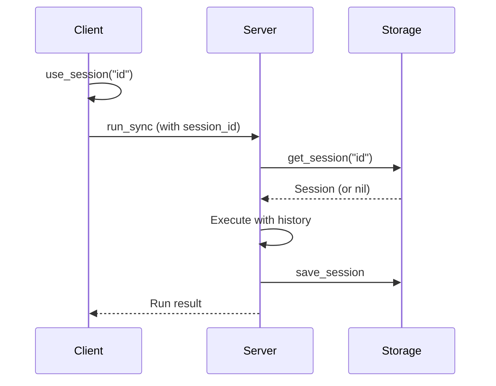

# Session Management

Sessions enable stateful interactions across multiple runs, maintaining conversation history and custom state.

## Using Sessions

### Enable Session

```ruby
client = SimpleAcp::Client::Base.new(base_url: "http://localhost:8000")

# Set the session to use
client.use_session("my-session-id")

# All subsequent runs use this session
client.run_sync(agent: "chat", input: [...])
client.run_sync(agent: "chat", input: [...])
```

### Clear Session

```ruby
# Stop using the session
client.clear_session

# Runs are now sessionless
client.run_sync(agent: "chat", input: [...])
```

### Check Active Session

```ruby
if client.session_id
  puts "Using session: #{client.session_id}"
else
  puts "No session active"
end
```

## Session IDs

### Generate Session IDs

```ruby
# User-specific session
client.use_session("user-#{user_id}")

# Conversation-specific
client.use_session("chat-#{SecureRandom.uuid}")

# Time-based
client.use_session("session-#{Time.now.to_i}")
```

### Meaningful Session IDs

```ruby
# Good: Traceable, meaningful
client.use_session("user-42-support-ticket-123")
client.use_session("api-key-abc123-chat")

# Avoid: Random, untraceable
client.use_session(SecureRandom.hex(32))
```

## Retrieving Session Data

### Get Session Info

```ruby
session = client.session("my-session-id")

puts "Session ID: #{session.id}"
puts "History length: #{session.history.length}"
puts "State: #{session.state.inspect}"
```

### Access History

```ruby
session = client.session("my-session-id")

session.history.each do |message|
  puts "#{message.role}: #{message.text_content}"
end
```

### Access State

```ruby
session = client.session("my-session-id")

if session.state
  puts "Current step: #{session.state['step']}"
  puts "User data: #{session.state['data'].inspect}"
end
```

## Conversation Patterns

### Multi-Turn Chat

```ruby
def chat_loop(client, agent)
  client.use_session("chat-#{SecureRandom.uuid}")

  loop do
    print "You: "
    input = gets.chomp
    break if input.downcase == 'quit'

    run = client.run_sync(
      agent: agent,
      input: [SimpleAcp::Models::Message.user(input)]
    )

    puts "Agent: #{run.output.first&.text_content}"
  end

  client.clear_session
end
```

### Context-Aware Responses

```ruby
client.use_session("support-123")

# First message
client.run_sync(
  agent: "support",
  input: [SimpleAcp::Models::Message.user("My order is late")]
)
# Agent: "I'm sorry to hear that. Can you provide your order number?"

# Follow-up (agent remembers context)
client.run_sync(
  agent: "support",
  input: [SimpleAcp::Models::Message.user("It's #12345")]
)
# Agent: "I found order #12345. It's expected to arrive tomorrow."
```

### Resuming Conversations

```ruby
# Save session ID for later
session_id = "user-#{user_id}-conversation"
client.use_session(session_id)

# ... user interacts ...

# Later, resume the same conversation
client = SimpleAcp::Client::Base.new(base_url: "...")
client.use_session(session_id)

# Continues where it left off
run = client.run_sync(agent: "chat", input: [...])
```

## Session Lifecycle



## Managing Multiple Sessions

### Per-User Sessions

```ruby
class ChatService
  def initialize(base_url)
    @clients = {}
    @base_url = base_url
  end

  def get_client(user_id)
    @clients[user_id] ||= begin
      client = SimpleAcp::Client::Base.new(base_url: @base_url)
      client.use_session("user-#{user_id}")
      client
    end
  end

  def chat(user_id, message)
    client = get_client(user_id)
    client.run_sync(
      agent: "chat",
      input: [SimpleAcp::Models::Message.user(message)]
    )
  end
end
```

### Session Pool

```ruby
class SessionPool
  def initialize(client)
    @client = client
    @sessions = {}
  end

  def with_session(session_id)
    @client.use_session(session_id)
    yield @client
  ensure
    @client.clear_session
  end
end

# Usage
pool = SessionPool.new(client)

pool.with_session("user-123") do |c|
  c.run_sync(agent: "chat", input: [...])
end
```

## Session Expiration

Sessions may expire based on storage backend:

### Redis (TTL-based)

```ruby
# Sessions expire after TTL (default 24 hours)
client.use_session("short-lived")
# ... interact ...

# After TTL, session is gone
# New run starts fresh session
```

### PostgreSQL (Persistent)

```ruby
# Sessions persist until explicitly deleted
client.use_session("persistent")
# ... can resume days later ...
```

### Memory (Process Lifetime)

```ruby
# Sessions lost when server restarts
```

## Error Handling

```ruby
begin
  session = client.session("unknown-session")
rescue SimpleAcp::Error => e
  if e.message.include?("not found")
    puts "Session doesn't exist"
  else
    raise
  end
end
```

## Best Practices

1. **Use meaningful IDs** - Include user/context info for debugging
2. **Clean up sessions** - Delete when conversations end
3. **Handle expiration** - Gracefully handle missing sessions
4. **Scope appropriately** - One session per conversation, not per user
5. **Monitor size** - Long sessions may have large history

## Session Cleanup

```ruby
# After conversation ends
def end_conversation(client, session_id)
  client.clear_session

  # Optionally delete server-side
  # (if supported by your storage)
end
```

## Testing with Sessions

```ruby
def test_multi_turn_conversation
  client = SimpleAcp::Client::Base.new(base_url: test_server_url)
  client.use_session("test-#{SecureRandom.uuid}")

  # First turn
  run1 = client.run_sync(
    agent: "counter",
    input: [SimpleAcp::Models::Message.user("increment")]
  )
  assert_includes run1.output.first.text_content, "1"

  # Second turn (should remember)
  run2 = client.run_sync(
    agent: "counter",
    input: [SimpleAcp::Models::Message.user("increment")]
  )
  assert_includes run2.output.first.text_content, "2"
ensure
  client.clear_session
end
```

## Next Steps

- Learn about [Sessions](../core-concepts/sessions.md) concept
- Explore [Multi-Turn Conversations](../server/multi-turn.md)
- Review [Storage Backends](../storage/index.md) for persistence options
