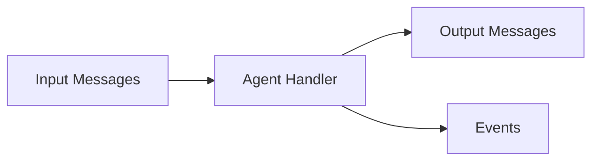

# Agents

Agents are the processing units in ACP that receive input messages and produce output messages. They encapsulate the logic for handling specific tasks.

## What is an Agent?

An agent is:

- A named, registered handler on a server
- Invoked with input messages
- Returns output messages (synchronously or via streaming)
- Optionally maintains state through sessions



## Registering Agents

### Block Syntax

The simplest way to create an agent:

```ruby
server = SimpleAcp::Server::Base.new

server.agent("echo", description: "Echoes input back") do |context|
  text = context.input.first&.text_content
  SimpleAcp::Models::Message.agent("Echo: #{text}")
end
```

### Agent Class

For complex agents, use a class:

```ruby
class WeatherAgent
  def call(context)
    location = context.input.first&.text_content
    weather = fetch_weather(location)
    SimpleAcp::Models::Message.agent("Weather in #{location}: #{weather}")
  end

  private

  def fetch_weather(location)
    # API call or lookup
  end
end

server.register("weather", WeatherAgent.new, description: "Gets weather")
```

### Agent Options

Configure agent behavior:

```ruby
server.agent(
  "processor",
  description: "Processes various content types",
  input_content_types: ["text/plain", "application/json"],
  output_content_types: ["application/json"],
  metadata: { version: "1.0", author: "Team" }
) do |context|
  # Handler logic
end
```

## The Context Object

Agents receive a `Context` object with:

| Property | Description |
|----------|-------------|
| `input` | Array of input messages |
| `session` | Current session (if any) |
| `history` | Previous messages in session |
| `state` | Session state data |
| `run_id` | Current run identifier |
| `agent_name` | Name of this agent |

### Accessing Input

```ruby
server.agent("analyzer") do |context|
  # Get first message's text
  text = context.input.first&.text_content

  # Process all messages
  all_text = context.input.map(&:text_content).join("\n")

  # Check for specific content types
  json_parts = context.input.flat_map(&:parts).select(&:json?)

  SimpleAcp::Models::Message.agent("Processed #{context.input.length} messages")
end
```

### Using Session State

```ruby
server.agent("counter") do |context|
  # Read state
  count = context.state || 0

  # Update state
  count += 1
  context.set_state(count)

  SimpleAcp::Models::Message.agent("Count: #{count}")
end
```

### Using History

```ruby
server.agent("summarizer") do |context|
  # Access conversation history
  previous = context.history.map(&:text_content).join("\n")

  SimpleAcp::Models::Message.agent(
    "Conversation so far:\n#{previous}\n\nNew: #{context.input.first&.text_content}"
  )
end
```

## Return Values

### Single Message

Return a single message:

```ruby
server.agent("simple") do |context|
  SimpleAcp::Models::Message.agent("Response")
end
```

### Multiple Messages

Return an array of messages:

```ruby
server.agent("multi") do |context|
  [
    SimpleAcp::Models::Message.agent("First response"),
    SimpleAcp::Models::Message.agent("Second response")
  ]
end
```

### Streaming with Enumerator

For streaming responses, return an Enumerator:

```ruby
server.agent("streamer") do |context|
  Enumerator.new do |yielder|
    5.times do |i|
      yielder << SimpleAcp::Server::RunYield.new(
        SimpleAcp::Models::Message.agent("Message #{i + 1}")
      )
      sleep 0.5
    end
  end
end
```

### Awaiting Input

Request additional input mid-execution:

```ruby
server.agent("questioner") do |context|
  Enumerator.new do |yielder|
    # Ask for input
    result = context.await_message(
      SimpleAcp::Models::Message.agent("What is your name?")
    )
    yielder << result

    # After resume, get the response
    name = context.resume_message&.text_content
    yielder << SimpleAcp::Server::RunYield.new(
      SimpleAcp::Models::Message.agent("Hello, #{name}!")
    )
  end
end
```

## Agent Manifest

Each agent has a manifest describing its capabilities:

```ruby
# Retrieved via client
manifest = client.agent("echo")

manifest.name                  # => "echo"
manifest.description           # => "Echoes input back"
manifest.input_content_types   # => ["text/plain"]
manifest.output_content_types  # => ["text/plain"]
manifest.metadata              # => {}
```

## Best Practices

### Keep Handlers Focused

Each agent should do one thing well:

```ruby
# Good: Single responsibility
server.agent("translate") { |ctx| translate(ctx.input) }
server.agent("summarize") { |ctx| summarize(ctx.input) }

# Avoid: Kitchen sink agents
server.agent("do_everything") { |ctx| ... }
```

### Handle Errors Gracefully

```ruby
server.agent("safe") do |context|
  begin
    process(context.input)
  rescue StandardError => e
    SimpleAcp::Models::Message.agent("Error: #{e.message}")
  end
end
```

### Use Descriptive Names

```ruby
# Good
server.agent("weather-forecast", description: "Gets 7-day weather forecast")
server.agent("text-summarizer", description: "Summarizes long text")

# Avoid
server.agent("agent1", description: "Does stuff")
```

## Next Steps

- Learn about [Runs](runs.md) that execute agents
- Explore [Sessions](sessions.md) for stateful agents
- See the [Server Guide](../server/creating-agents.md) for advanced patterns
