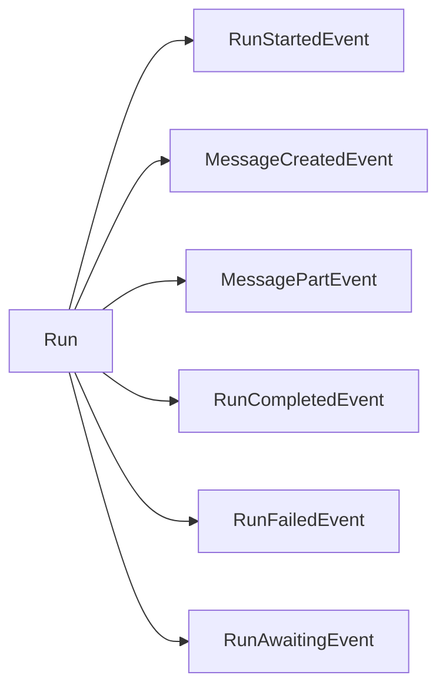
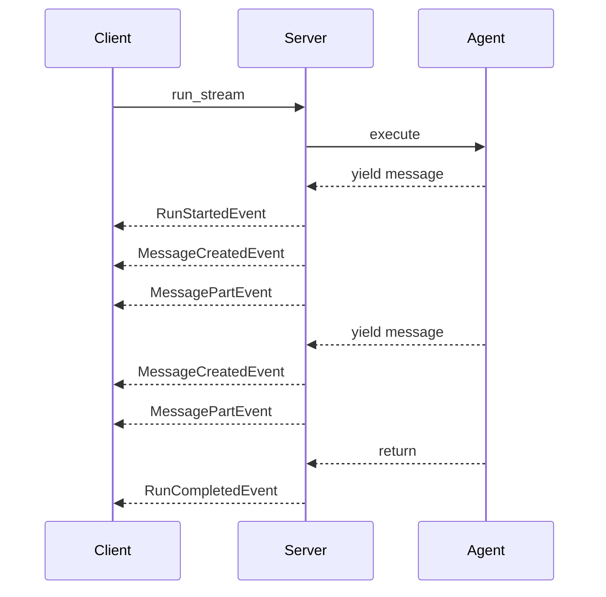

# Events

Events provide real-time updates during run execution. They enable streaming responses, progress tracking, and reactive client applications.

## Event Types



### RunStartedEvent

Emitted when a run begins execution:

```ruby
event.type     # => "run_started"
event.run_id   # => "550e8400-..."
```

### MessageCreatedEvent

Emitted when a new message is created:

```ruby
event.type     # => "message_created"
event.message  # => Message object
```

### MessagePartEvent

Emitted for each part of a message (enables streaming):

```ruby
event.type  # => "message_part"
event.part  # => MessagePart object
```

### MessageCompletedEvent

Emitted when a message is fully assembled:

```ruby
event.type     # => "message_completed"
event.message  # => Complete Message object
```

### RunCompletedEvent

Emitted when a run finishes successfully:

```ruby
event.type   # => "run_completed"
event.run    # => Completed Run object
```

### RunFailedEvent

Emitted when a run encounters an error:

```ruby
event.type   # => "run_failed"
event.run    # => Failed Run object
event.error  # => Error object
```

### RunAwaitingEvent

Emitted when a run needs additional input:

```ruby
event.type          # => "run_awaiting"
event.run           # => Run object
event.await_request # => AwaitRequest object
```

## Consuming Events

### Streaming Client

```ruby
client.run_stream(agent: "chat", input: messages) do |event|
  case event
  when SimpleAcp::Models::RunStartedEvent
    puts "Run #{event.run_id} started"

  when SimpleAcp::Models::MessageCreatedEvent
    puts "New message from #{event.message.role}"

  when SimpleAcp::Models::MessagePartEvent
    # Stream content as it arrives
    print event.part.content
    $stdout.flush

  when SimpleAcp::Models::MessageCompletedEvent
    puts "\n--- Message complete ---"

  when SimpleAcp::Models::RunCompletedEvent
    puts "\nRun completed!"

  when SimpleAcp::Models::RunFailedEvent
    puts "\nError: #{event.error.message}"

  when SimpleAcp::Models::RunAwaitingEvent
    puts "\nAwaiting input..."
  end
end
```

### Fetching Historical Events

```ruby
events = client.run_events(run_id)

events.each do |event|
  puts "#{event.type}: #{event.inspect}"
end
```

## Server-Side Events

### Yielding Events

Agents emit events by yielding from an Enumerator:

```ruby
server.agent("streamer") do |context|
  Enumerator.new do |yielder|
    words = context.input.first&.text_content&.split || []

    words.each do |word|
      # Each yield creates events
      yielder << SimpleAcp::Server::RunYield.new(
        SimpleAcp::Models::Message.agent(word + " ")
      )
      sleep 0.1
    end
  end
end
```

### Event Flow



## Server-Sent Events (SSE)

When using HTTP streaming, events are delivered via Server-Sent Events:

```
GET /runs HTTP/1.1
Accept: text/event-stream

HTTP/1.1 200 OK
Content-Type: text/event-stream

event: run_started
data: {"run_id":"550e8400-..."}

event: message_part
data: {"part":{"content_type":"text/plain","content":"Hello"}}

event: run_completed
data: {"run":{...}}
```

### Raw SSE Handling

```ruby
require 'faraday'

conn = Faraday.new(url: 'http://localhost:8000')

conn.post('/runs') do |req|
  req.headers['Accept'] = 'text/event-stream'
  req.body = { agent_name: 'chat', input: [...] }.to_json

  req.options.on_data = proc do |chunk, _|
    # Parse SSE format
    chunk.split("\n\n").each do |event_text|
      # Process event...
    end
  end
end
```

## Common Patterns

### Progress Indicator

```ruby
total = 0
client.run_stream(agent: "processor", input: data) do |event|
  case event
  when SimpleAcp::Models::MessagePartEvent
    total += 1
    print "\rProcessed: #{total} items"
  when SimpleAcp::Models::RunCompletedEvent
    puts "\nDone!"
  end
end
```

### Collecting All Output

```ruby
messages = []

client.run_stream(agent: "chat", input: question) do |event|
  case event
  when SimpleAcp::Models::MessageCompletedEvent
    messages << event.message
  end
end

puts "Received #{messages.length} messages"
```

### Error Recovery

```ruby
begin
  client.run_stream(agent: "risky", input: data) do |event|
    case event
    when SimpleAcp::Models::RunFailedEvent
      log_error(event.error)
      # Don't raise, handle gracefully
    end
  end
rescue Faraday::TimeoutError
  puts "Stream timed out"
  # Retry logic...
end
```

### Building Real-Time UI

```ruby
# In a web application
def stream_response(agent, input)
  response.headers['Content-Type'] = 'text/event-stream'

  client.run_stream(agent: agent, input: input) do |event|
    case event
    when SimpleAcp::Models::MessagePartEvent
      response.write("data: #{event.part.content.to_json}\n\n")
    when SimpleAcp::Models::RunCompletedEvent
      response.write("event: done\ndata: {}\n\n")
    end
  end
end
```

## Event Persistence

Events are stored and can be retrieved later:

```ruby
# Run completes
run = client.run_sync(agent: "logger", input: [...])

# Later, retrieve events
events = client.run_events(run.run_id)
events.each { |e| puts e.type }
```

## Best Practices

### Handle All Event Types

```ruby
client.run_stream(agent: "...", input: [...]) do |event|
  case event
  when SimpleAcp::Models::RunStartedEvent
    # Handle start
  when SimpleAcp::Models::MessagePartEvent
    # Handle streaming content
  when SimpleAcp::Models::RunCompletedEvent
    # Handle completion
  when SimpleAcp::Models::RunFailedEvent
    # Handle errors
  when SimpleAcp::Models::RunAwaitingEvent
    # Handle await
  else
    # Log unknown events
    logger.warn("Unknown event: #{event.type}")
  end
end
```

### Use Events for UX

```ruby
# Show typing indicator
client.run_stream(agent: "chat", input: [...]) do |event|
  case event
  when SimpleAcp::Models::RunStartedEvent
    show_typing_indicator
  when SimpleAcp::Models::MessagePartEvent
    hide_typing_indicator
    append_content(event.part.content)
  when SimpleAcp::Models::RunCompletedEvent
    mark_complete
  end
end
```

## Next Steps

- Explore [Client Streaming](../client/streaming.md) for advanced patterns
- Learn about [Server Streaming](../server/streaming.md) for generating events
- See the [API Reference](../api/models.md) for event model details
