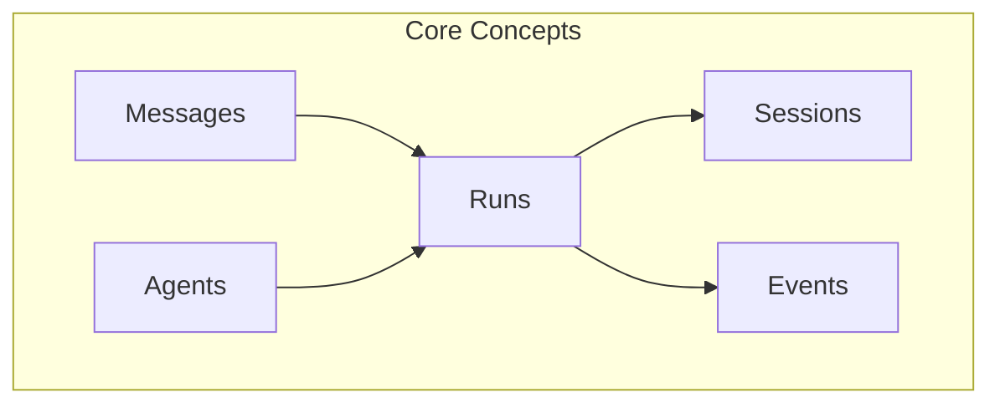
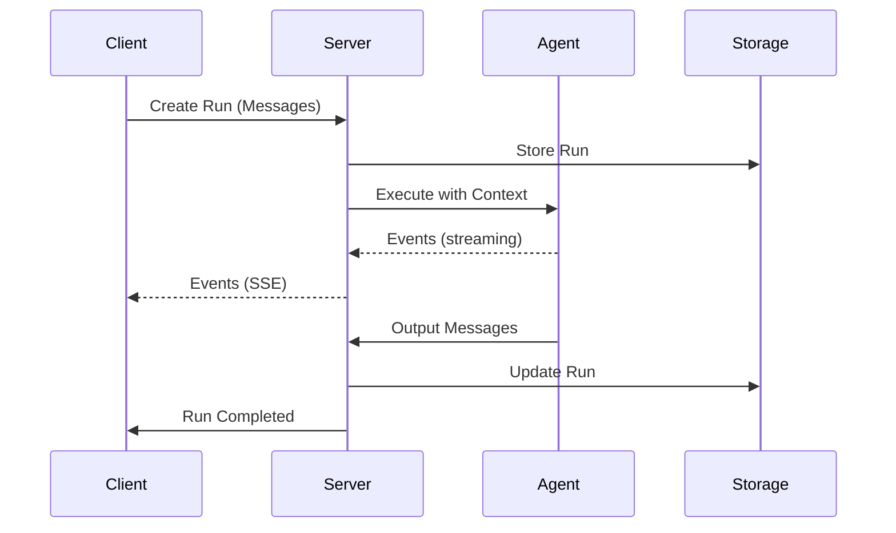

# Core Concepts

Understanding the core concepts of the Agent Communication Protocol (ACP) is essential for building effective agent systems with SimpleAcp.

## Overview

ACP defines a standardized way for agents, applications, and humans to communicate. The protocol centers around these key concepts:



## The Building Blocks

### Messages

[Messages](messages.md) are the fundamental unit of communication. They carry content between users and agents.

```ruby
# User sends a message
message = SimpleAcp::Models::Message.user("What's the weather?")

# Agent responds with a message
response = SimpleAcp::Models::Message.agent("It's sunny and 72°F")
```

### Agents

[Agents](agents.md) are the processing units that receive input and produce output. They're registered on servers and can be invoked by clients.

```ruby
server.agent("weather", description: "Gets weather information") do |context|
  # Process context.input and return response
end
```

### Runs

[Runs](runs.md) represent a single execution of an agent. They track the lifecycle from start to completion, including any errors or awaiting states.

```ruby
run = client.run_sync(agent: "weather", input: [...])
puts run.status      # "completed"
puts run.output      # Response messages
```

### Sessions

[Sessions](sessions.md) maintain state across multiple runs, enabling multi-turn conversations and stateful interactions.

```ruby
client.use_session("conversation-123")
# All subsequent runs share this session
```

### Events

[Events](events.md) provide real-time updates during run execution, enabling streaming responses and progress tracking.

```ruby
client.run_stream(agent: "...", input: [...]) do |event|
  case event
  when SimpleAcp::Models::MessagePartEvent
    print event.part.content  # Stream as it arrives
  end
end
```

## How They Work Together

Here's how these concepts interact in a typical flow:



1. **Client** creates a run by sending input messages to the server
2. **Server** creates a Run record and invokes the appropriate agent
3. **Agent** processes the input through its handler, optionally yielding events
4. **Events** stream back to the client in real-time
5. **Run** completes with output messages
6. **Session** (if used) maintains state for subsequent runs

## Deep Dives

<div class="grid cards" markdown>

-   :material-message-text:{ .lg .middle } **Messages**

    ---

    Learn about message structure, parts, and content types

    [:octicons-arrow-right-24: Messages](messages.md)

-   :material-robot:{ .lg .middle } **Agents**

    ---

    Understand agent registration and the handler pattern

    [:octicons-arrow-right-24: Agents](agents.md)

-   :material-play-circle:{ .lg .middle } **Runs**

    ---

    Explore run lifecycle, status, and execution modes

    [:octicons-arrow-right-24: Runs](runs.md)

-   :material-history:{ .lg .middle } **Sessions**

    ---

    Master stateful interactions and conversation history

    [:octicons-arrow-right-24: Sessions](sessions.md)

-   :material-lightning-bolt:{ .lg .middle } **Events**

    ---

    Handle real-time streaming updates

    [:octicons-arrow-right-24: Events](events.md)

</div>
