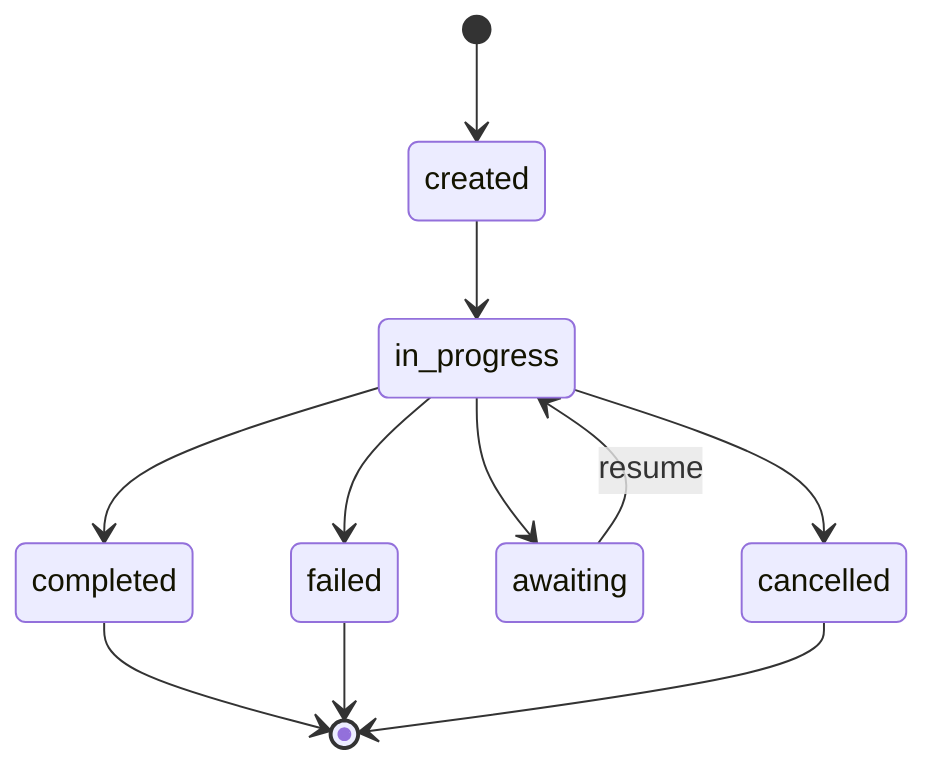

# Runs

A Run represents a single execution of an agent. It tracks the complete lifecycle from initiation to completion, including status, output, and any errors.

## Run Lifecycle



## Run States

| Status | Description |
|--------|-------------|
| `created` | Run has been created but not started |
| `in_progress` | Agent is currently executing |
| `completed` | Agent finished successfully |
| `failed` | Agent encountered an error |
| `awaiting` | Agent is waiting for additional input |
| `cancelled` | Run was cancelled by request |

## Creating Runs

### Synchronous

Execute and wait for completion:

```ruby
run = client.run_sync(
  agent: "echo",
  input: [SimpleAcp::Models::Message.user("Hello")]
)

puts run.status        # => "completed"
puts run.output.first  # => Message object
```

### Asynchronous

Start execution and poll for results:

```ruby
run = client.run_async(
  agent: "slow-processor",
  input: [SimpleAcp::Models::Message.user("Process this")]
)

puts run.status  # => "in_progress"

# Poll until complete
loop do
  run = client.run_status(run.run_id)
  break if run.terminal?
  sleep 1
end

puts run.output
```

### Streaming

Receive real-time events:

```ruby
client.run_stream(
  agent: "chat",
  input: [SimpleAcp::Models::Message.user("Tell me a story")]
) do |event|
  case event
  when SimpleAcp::Models::RunStartedEvent
    puts "Started: #{event.run_id}"
  when SimpleAcp::Models::MessagePartEvent
    print event.part.content
  when SimpleAcp::Models::RunCompletedEvent
    puts "\nDone!"
  end
end
```

## Run Properties

```ruby
run = client.run_sync(agent: "echo", input: [...])

# Identification
run.run_id        # => "550e8400-e29b-41d4-a716-446655440000"
run.agent_name    # => "echo"
run.session_id    # => "session-123" or nil

# Status
run.status        # => "completed"
run.terminal?     # => true
run.completed?    # => true
run.failed?       # => false
run.awaiting?     # => false
run.cancelled?    # => false

# Output
run.output        # => Array of Messages
run.error         # => Error object or nil

# Timestamps
run.created_at    # => Time
run.finished_at   # => Time or nil
```

## Handling Different States

### Completed Runs

```ruby
run = client.run_sync(agent: "processor", input: [...])

if run.completed?
  run.output.each do |message|
    puts message.text_content
  end
end
```

### Failed Runs

```ruby
run = client.run_sync(agent: "risky", input: [...])

if run.failed?
  puts "Error code: #{run.error.code}"
  puts "Error message: #{run.error.message}"
end
```

### Awaiting Runs

```ruby
run = client.run_sync(agent: "questioner", input: [...])

if run.awaiting?
  # The agent is waiting for more input
  puts run.await_request.message.text_content

  # Resume with a response
  run = client.run_resume_sync(
    run_id: run.run_id,
    await_resume: SimpleAcp::Models::MessageAwaitResume.new(
      message: SimpleAcp::Models::Message.user("My response")
    )
  )
end
```

## Run Management

### Get Run Status

```ruby
run = client.run_status("run-id-here")
puts run.status
```

### Get Run Events

```ruby
events = client.run_events("run-id-here")
events.each do |event|
  puts "#{event.type}: #{event.inspect}"
end
```

### Cancel a Run

```ruby
# Cancel an in-progress run
client.run_cancel("run-id-here")
```

## Server-Side Runs

On the server, runs are managed internally:

```ruby
# Create and execute a run programmatically
run = server.run_sync(
  agent_name: "processor",
  input: [SimpleAcp::Models::Message.user("Data")],
  session_id: "optional-session"
)

# Stream execution
server.run_stream(
  agent_name: "streamer",
  input: messages
) do |event|
  # Handle events
end
```

## Run with Sessions

Associate runs with sessions for stateful interactions:

```ruby
# Client side
client.use_session("conversation-123")

# All runs now use this session
run1 = client.run_sync(agent: "chat", input: [...])
run2 = client.run_sync(agent: "chat", input: [...])

# Server side
run = server.run_sync(
  agent_name: "chat",
  input: messages,
  session_id: "conversation-123"
)
```

## Best Practices

### Always Check Status

```ruby
run = client.run_sync(agent: "...", input: [...])

case run.status
when "completed"
  process_output(run.output)
when "failed"
  handle_error(run.error)
when "awaiting"
  handle_await(run)
else
  log_unexpected_status(run.status)
end
```

### Use Streaming for Long Operations

```ruby
# Better UX for slow operations
client.run_stream(agent: "slow-agent", input: [...]) do |event|
  show_progress(event)
end
```

### Handle Timeouts

```ruby
run = client.run_async(agent: "slow", input: [...])
timeout = Time.now + 60

loop do
  run = client.run_status(run.run_id)
  break if run.terminal?

  if Time.now > timeout
    client.run_cancel(run.run_id)
    raise "Run timed out"
  end

  sleep 1
end
```

## Next Steps

- Learn about [Sessions](sessions.md) for stateful runs
- Explore [Events](events.md) for real-time updates
- See [Client Streaming](../client/streaming.md) for advanced streaming patterns
