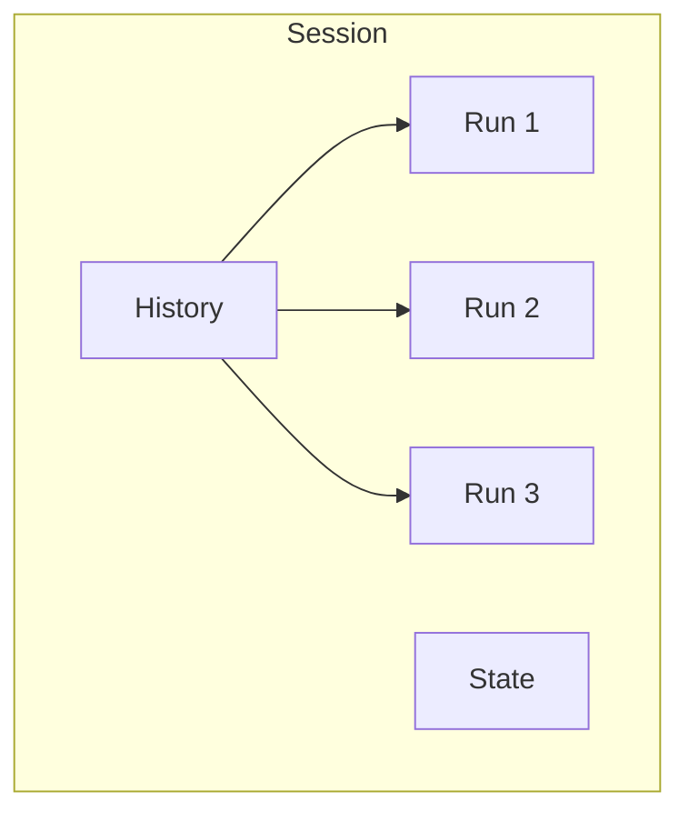

# Sessions

Sessions enable stateful interactions across multiple runs. They maintain conversation history and custom state data, allowing agents to remember context from previous interactions.

## What is a Session?

A session is a container for:

- **History**: Previous messages in the conversation
- **State**: Custom data persisted across runs
- **Identity**: A unique session ID



## Creating Sessions

### Client-Side Sessions

```ruby
client = SimpleAcp::Client::Base.new(base_url: "http://localhost:8000")

# Use a specific session
client.use_session("user-123-conversation")

# All subsequent runs use this session
client.run_sync(agent: "chat", input: [...])
client.run_sync(agent: "chat", input: [...])

# Clear when done
client.clear_session
```

### Server-Side Sessions

```ruby
# Specify session when creating a run
run = server.run_sync(
  agent_name: "chat",
  input: messages,
  session_id: "conversation-456"
)
```

## Session History

History automatically accumulates messages across runs:

```ruby
# First run
client.use_session("my-session")
client.run_sync(agent: "chat", input: [Message.user("Hello")])
# History: [user: "Hello", agent: "Hi there!"]

# Second run
client.run_sync(agent: "chat", input: [Message.user("How are you?")])
# History: [user: "Hello", agent: "Hi there!", user: "How are you?", agent: "I'm good!"]
```

### Accessing History in Agents

```ruby
server.agent("contextual") do |context|
  # Get all previous messages
  history = context.history

  # Build context from history
  conversation = history.map do |msg|
    "#{msg.role}: #{msg.text_content}"
  end.join("\n")

  SimpleAcp::Models::Message.agent(
    "Based on our conversation:\n#{conversation}\n\nContinuing..."
  )
end
```

## Session State

Custom state data persists across runs:

```ruby
server.agent("counter") do |context|
  # Read current state (nil if first run)
  count = context.state || 0

  # Increment
  count += 1

  # Save new state
  context.set_state(count)

  SimpleAcp::Models::Message.agent("Count: #{count}")
end
```

### Complex State

State can be any JSON-serializable data:

```ruby
server.agent("quiz") do |context|
  state = context.state || { score: 0, questions_asked: 0 }

  # Update state
  state[:questions_asked] += 1
  if correct_answer?(context.input)
    state[:score] += 1
  end

  context.set_state(state)

  SimpleAcp::Models::Message.agent(
    "Score: #{state[:score]}/#{state[:questions_asked]}"
  )
end
```

## Session Properties

```ruby
session = client.session("session-id")

session.id       # => "session-id"
session.history  # => Array of Messages
session.state    # => Custom state data or nil
```

## Session Storage

Sessions are persisted by the storage backend:

=== "Memory"

    ```ruby
    # Sessions lost on restart
    storage = SimpleAcp::Storage::Memory.new
    ```

=== "Redis"

    ```ruby
    # Sessions expire after TTL
    storage = SimpleAcp::Storage::Redis.new(
      ttl: 86400  # 24 hours
    )
    ```

=== "PostgreSQL"

    ```ruby
    # Sessions persist indefinitely
    storage = SimpleAcp::Storage::PostgreSQL.new(
      url: ENV['DATABASE_URL']
    )
    ```

## Common Patterns

### Multi-Turn Conversation

```ruby
server.agent("assistant") do |context|
  # Build prompt with history
  messages = context.history + context.input

  # Call LLM with full context
  response = llm.chat(messages)

  SimpleAcp::Models::Message.agent(response)
end
```

### User Preferences

```ruby
server.agent("personalized") do |context|
  state = context.state || { preferences: {} }

  # Check for preference updates
  if context.input.first&.text_content&.start_with?("set preference")
    key, value = parse_preference(context.input.first.text_content)
    state[:preferences][key] = value
    context.set_state(state)
    return SimpleAcp::Models::Message.agent("Preference saved!")
  end

  # Use preferences
  prefs = state[:preferences]
  # ...
end
```

### Shopping Cart

```ruby
server.agent("cart") do |context|
  cart = context.state || { items: [], total: 0 }

  command = context.input.first&.text_content

  case command
  when /^add (.+)/
    item = $1
    cart[:items] << item
    cart[:total] += get_price(item)
  when /^remove (.+)/
    item = $1
    cart[:items].delete(item)
    cart[:total] -= get_price(item)
  when "checkout"
    # Process order...
    cart = { items: [], total: 0 }
  end

  context.set_state(cart)

  SimpleAcp::Models::Message.agent(
    "Cart: #{cart[:items].join(', ')} - Total: $#{cart[:total]}"
  )
end
```

## Best Practices

### Generate Meaningful Session IDs

```ruby
# Good: Meaningful, traceable
client.use_session("user-#{user_id}-chat-#{timestamp}")

# Avoid: Random, hard to debug
client.use_session(SecureRandom.uuid)
```

### Clean Up Sessions

```ruby
# When conversation ends
client.clear_session

# Or delete server-side
storage.delete_session(session_id)
```

### Limit History Size

```ruby
server.agent("bounded") do |context|
  # Only use recent history
  recent = context.history.last(10)
  # ...
end
```

### Handle Missing State

```ruby
server.agent("safe") do |context|
  # Always provide defaults
  state = context.state || default_state

  # Validate state structure
  state[:version] ||= 1
  state[:data] ||= {}
  # ...
end
```

## Next Steps

- Learn about [Events](events.md) for real-time updates
- Explore [Multi-Turn Conversations](../server/multi-turn.md)
- See [Session Management](../client/sessions.md) in the client guide
