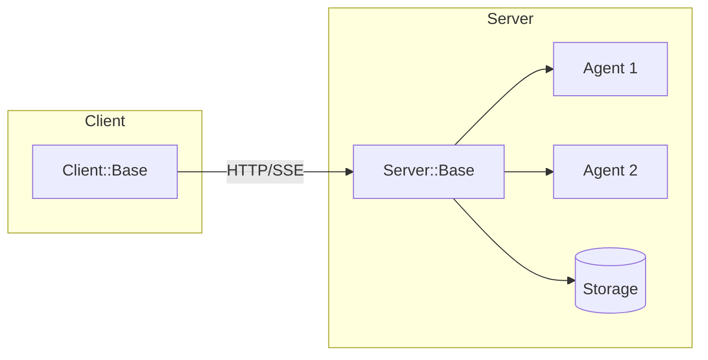

# SimpleAcp

<div class="grid" markdown>

<div markdown>

{ width="100%" }

</div>

<div markdown>

**A Ruby implementation of the Agent Communication Protocol (ACP)**

SimpleAcp provides an open protocol for communication between AI agents, applications, and humans. Build agent servers, connect with HTTP clients, and stream responses in real-time.

| | |
|---|---|
| :material-robot: Full ACP Protocol | :material-sync: Sync/Async/Stream |
| :material-message-text: Session Management | :material-image: Multimodal Messages |
| :material-database: Pluggable Storage | :material-lightning-bolt: SSE Streaming |

</div>

</div>

<p align="center" markdown>
[:material-download: Install](getting-started/installation.md){ .md-button .md-button--primary }
[:material-rocket-launch: Quick Start](getting-started/quick-start.md){ .md-button }
</p>

---

## Features

- **Full ACP Protocol Support**: Complete implementation including agents, runs, sessions, and events
- **Multiple Run Modes**: Synchronous, asynchronous, and streaming execution patterns
- **Session Management**: Maintain state and conversation history across interactions
- **Multimodal Messages**: Support for text, JSON, images, and URL references
- **Pluggable Storage**: In-memory, Redis, and PostgreSQL backends included
- **SSE Streaming**: Server-Sent Events for real-time response streaming

## Quick Example

```ruby
require 'simple_acp'

# Create a server with an agent
server = SimpleAcp::Server::Base.new

server.agent("greeter", description: "Greets users") do |context|
  name = context.input.first&.text_content || "World"
  SimpleAcp::Models::Message.agent("Hello, #{name}!")
end

server.run(port: 8000)
```

```ruby
# Connect with a client
client = SimpleAcp::Client::Base.new(base_url: "http://localhost:8000")

run = client.run_sync(
  agent: "greeter",
  input: [SimpleAcp::Models::Message.user("Alice")]
)

puts run.output.first.text_content
# => "Hello, Alice!"
```

## Architecture Overview



SimpleAcp follows a client-server architecture:

- **Server**: Hosts agents and handles HTTP requests via Roda/Puma
- **Agents**: Process input and produce output messages
- **Client**: Communicates with servers over HTTP with optional SSE streaming
- **Storage**: Persists runs, sessions, and events

## Getting Started

Ready to build your first agent? Head to the [Installation](getting-started/installation.md) guide to get started.

[Get Started :material-arrow-right:](getting-started/installation.md){ .md-button .md-button--primary }
[View on GitHub :material-github:](https://github.com/MadBomber/simple_acp){ .md-button }
