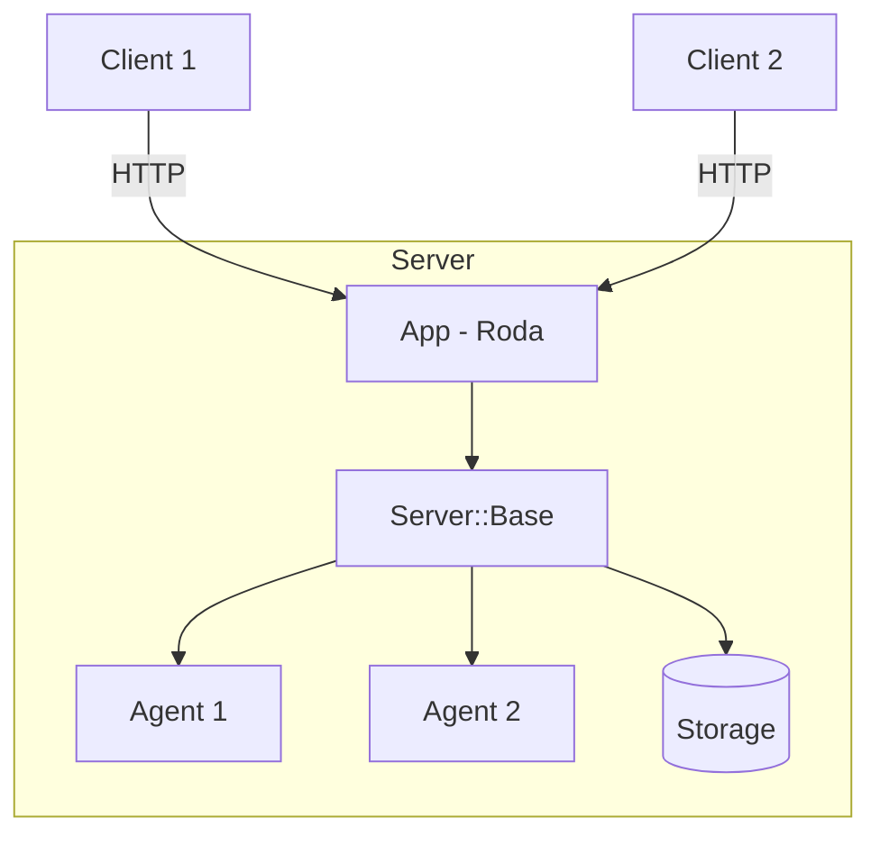

# Server Guide

The SimpleAcp server hosts agents and handles HTTP requests from clients. This guide covers everything you need to build robust agent servers.

## Overview



## Quick Start

```ruby
require 'simple_acp'

server = SimpleAcp::Server::Base.new

server.agent("hello") do |context|
  SimpleAcp::Models::Message.agent("Hello from SimpleAcp!")
end

server.run(port: 8000)
```

## In This Section

<div class="grid cards" markdown>

-   :material-robot:{ .lg .middle } **Creating Agents**

    ---

    Learn patterns for building effective agents

    [:octicons-arrow-right-24: Creating Agents](creating-agents.md)

-   :material-play-speed:{ .lg .middle } **Streaming Responses**

    ---

    Implement real-time streaming with SSE

    [:octicons-arrow-right-24: Streaming](streaming.md)

-   :material-chat-processing:{ .lg .middle } **Multi-Turn Conversations**

    ---

    Build stateful, context-aware agents

    [:octicons-arrow-right-24: Multi-Turn](multi-turn.md)

-   :material-api:{ .lg .middle } **HTTP Endpoints**

    ---

    Reference for all server endpoints

    [:octicons-arrow-right-24: HTTP Endpoints](http-endpoints.md)

</div>

## Server Architecture

### Components

| Component | Purpose |
|-----------|---------|
| `Server::Base` | Core server managing agents and runs |
| `Server::App` | Roda HTTP application |
| `Server::Context` | Execution context passed to agents |
| `Server::Agent` | Agent wrapper with metadata |

### Server Lifecycle

```ruby
# 1. Create server with optional storage
server = SimpleAcp::Server::Base.new(
  storage: SimpleAcp::Storage::Memory.new
)

# 2. Register agents
server.agent("name", description: "...") do |context|
  # Handler logic
end

# 3. Start HTTP server (uses Puma)
server.run(port: 8000)
```

### Programmatic Usage

Use the server without HTTP:

```ruby
# Create runs directly
run = server.run_sync(
  agent_name: "processor",
  input: [SimpleAcp::Models::Message.user("Data")]
)

# Stream events
server.run_stream(agent_name: "streamer", input: messages) do |event|
  # Handle events
end
```

## Configuration

### Storage

```ruby
# Memory (default)
server = SimpleAcp::Server::Base.new

# Redis
server = SimpleAcp::Server::Base.new(
  storage: SimpleAcp::Storage::Redis.new(url: ENV['REDIS_URL'])
)

# PostgreSQL
server = SimpleAcp::Server::Base.new(
  storage: SimpleAcp::Storage::PostgreSQL.new(url: ENV['DATABASE_URL'])
)
```

### HTTP Server Options

```ruby
server.run(
  port: 8000,
  host: '0.0.0.0',
  workers: 2,
  threads: '1:5'
)
```

## Best Practices

### Agent Organization

```ruby
# Group related agents
class MyServer
  def initialize
    @server = SimpleAcp::Server::Base.new
    register_chat_agents
    register_utility_agents
  end

  private

  def register_chat_agents
    @server.agent("chat") { |ctx| ... }
    @server.agent("summarize") { |ctx| ... }
  end

  def register_utility_agents
    @server.agent("ping") { |ctx| ... }
    @server.agent("echo") { |ctx| ... }
  end
end
```

### Error Handling

```ruby
server.agent("safe") do |context|
  begin
    risky_operation(context.input)
  rescue ValidationError => e
    SimpleAcp::Models::Message.agent("Invalid input: #{e.message}")
  rescue ExternalServiceError => e
    # Log and return friendly error
    logger.error("External service failed: #{e}")
    SimpleAcp::Models::Message.agent("Service temporarily unavailable")
  end
end
```

### Logging

```ruby
server.agent("logged") do |context|
  logger.info("Processing request", {
    run_id: context.run_id,
    agent: context.agent_name,
    input_count: context.input.length
  })

  result = process(context.input)

  logger.info("Request completed", {
    run_id: context.run_id,
    output_count: result.length
  })

  result
end
```

## Next Steps

Start with [Creating Agents](creating-agents.md) to learn agent development patterns.
