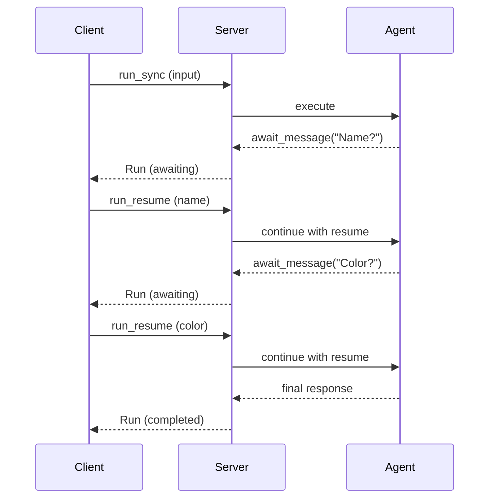

# Multi-Turn Conversations

Multi-turn conversations allow agents to maintain context across multiple interactions, request additional input, and build stateful experiences.

## Using Sessions

Sessions maintain history and state:

```ruby
server.agent("chat") do |context|
  # Access conversation history
  history = context.history

  # Build context from history
  all_messages = history + context.input

  # Generate response considering full context
  response = generate_response(all_messages)

  SimpleAcp::Models::Message.agent(response)
end
```

## Session History

History automatically accumulates:

```ruby
# First interaction
# history: []
# input: [user: "Hello"]
# After: history becomes [user: "Hello", agent: "Hi!"]

# Second interaction
# history: [user: "Hello", agent: "Hi!"]
# input: [user: "How are you?"]
# After: history becomes [user: "Hello", agent: "Hi!", user: "How are you?", agent: "I'm good!"]
```

## Session State

Custom state persists across turns:

```ruby
server.agent("counter") do |context|
  count = context.state || 0
  count += 1
  context.set_state(count)

  SimpleAcp::Models::Message.agent("Turn #{count}")
end
```

### Complex State

```ruby
server.agent("form") do |context|
  state = context.state || { step: 1, data: {} }

  case state[:step]
  when 1
    context.set_state(state.merge(step: 2))
    SimpleAcp::Models::Message.agent("Enter your name:")
  when 2
    state[:data][:name] = context.input.first&.text_content
    context.set_state(state.merge(step: 3))
    SimpleAcp::Models::Message.agent("Enter your email:")
  when 3
    state[:data][:email] = context.input.first&.text_content
    context.set_state(state.merge(step: :done))
    SimpleAcp::Models::Message.agent(
      "Thanks #{state[:data][:name]}! We'll contact you at #{state[:data][:email]}"
    )
  else
    SimpleAcp::Models::Message.agent("Form complete!")
  end
end
```

## Awaiting Input

For synchronous input requests within a single run:

```ruby
server.agent("questioner") do |context|
  Enumerator.new do |yielder|
    # Ask first question
    result = context.await_message(
      SimpleAcp::Models::Message.agent("What is your name?")
    )
    yielder << result

    # After resume, get the answer
    name = context.resume_message&.text_content

    # Ask second question
    result = context.await_message(
      SimpleAcp::Models::Message.agent("What is your favorite color, #{name}?")
    )
    yielder << result

    color = context.resume_message&.text_content

    # Final response
    yielder << SimpleAcp::Server::RunYield.new(
      SimpleAcp::Models::Message.agent("Great choice, #{name}! #{color} is nice.")
    )
  end
end
```

### Await Flow



### Client-Side Await Handling

```ruby
run = client.run_sync(agent: "questioner", input: [...])

while run.awaiting?
  puts run.await_request.message.text_content

  answer = gets.chomp

  run = client.run_resume_sync(
    run_id: run.run_id,
    await_resume: SimpleAcp::Models::MessageAwaitResume.new(
      message: SimpleAcp::Models::Message.user(answer)
    )
  )
end

puts "Final: #{run.output.last.text_content}"
```

## Conversation Patterns

### Contextual Responses

```ruby
server.agent("assistant") do |context|
  # Build full conversation
  conversation = context.history.map do |msg|
    { role: msg.role, content: msg.text_content }
  end

  conversation << {
    role: "user",
    content: context.input.first&.text_content
  }

  # Use LLM with full context
  response = llm.chat(conversation)

  SimpleAcp::Models::Message.agent(response)
end
```

### Memory Management

Limit history for efficiency:

```ruby
server.agent("bounded-chat") do |context|
  # Only use last 10 messages
  recent_history = context.history.last(10)

  conversation = recent_history + context.input

  response = generate_response(conversation)

  SimpleAcp::Models::Message.agent(response)
end
```

### Summarization

```ruby
server.agent("summarizing-chat") do |context|
  state = context.state || { summary: nil }

  if context.history.length > 20
    # Summarize older history
    old_messages = context.history[0..-11]
    state[:summary] = summarize(old_messages)
    context.set_state(state)
  end

  # Use summary + recent history
  conversation_context = [
    state[:summary] ? "Previous context: #{state[:summary]}" : nil,
    *context.history.last(10).map(&:text_content),
    context.input.first&.text_content
  ].compact

  response = generate_response(conversation_context)

  SimpleAcp::Models::Message.agent(response)
end
```

### Conversation Reset

```ruby
server.agent("resettable") do |context|
  command = context.input.first&.text_content

  if command&.downcase == "reset"
    context.set_state(nil)
    return SimpleAcp::Models::Message.agent("Conversation reset!")
  end

  # Normal processing...
end
```

## Interactive Workflows

### Quiz Game

```ruby
server.agent("quiz") do |context|
  state = context.state || {
    score: 0,
    question_index: 0,
    questions: load_questions
  }

  if state[:question_index] > 0
    # Check previous answer
    answer = context.input.first&.text_content
    correct = state[:questions][state[:question_index] - 1][:answer]

    if answer&.downcase == correct.downcase
      state[:score] += 1
    end
  end

  if state[:question_index] >= state[:questions].length
    context.set_state(nil)
    return SimpleAcp::Models::Message.agent(
      "Quiz complete! Score: #{state[:score]}/#{state[:questions].length}"
    )
  end

  question = state[:questions][state[:question_index]]
  state[:question_index] += 1
  context.set_state(state)

  SimpleAcp::Models::Message.agent(question[:text])
end
```

### Shopping Assistant

```ruby
server.agent("shop") do |context|
  cart = context.state || { items: [], total: 0.0 }
  command = context.input.first&.text_content&.downcase

  response = case command
  when /^add (.+)/
    item = find_product($1)
    if item
      cart[:items] << item
      cart[:total] += item[:price]
      "Added #{item[:name]} ($#{item[:price]})"
    else
      "Product not found"
    end
  when /^remove (.+)/
    item = cart[:items].find { |i| i[:name].downcase.include?($1) }
    if item
      cart[:items].delete(item)
      cart[:total] -= item[:price]
      "Removed #{item[:name]}"
    else
      "Item not in cart"
    end
  when "cart"
    items_list = cart[:items].map { |i| "- #{i[:name]}: $#{i[:price]}" }.join("\n")
    "Cart:\n#{items_list}\nTotal: $#{cart[:total]}"
  when "checkout"
    total = cart[:total]
    context.set_state(nil)
    "Order placed! Total: $#{total}"
  else
    "Commands: add <item>, remove <item>, cart, checkout"
  end

  context.set_state(cart)
  SimpleAcp::Models::Message.agent(response)
end
```

## Best Practices

1. **Limit history size** - Don't let history grow unbounded
2. **Use state wisely** - Store minimal necessary data
3. **Handle resets** - Allow users to start fresh
4. **Validate state** - Check for expected structure
5. **Test edge cases** - Empty history, missing state, etc.

## Next Steps

- Review [Sessions](../core-concepts/sessions.md) concept
- See [Client Sessions](../client/sessions.md) for client-side handling
- Explore [HTTP Endpoints](http-endpoints.md) for session APIs
