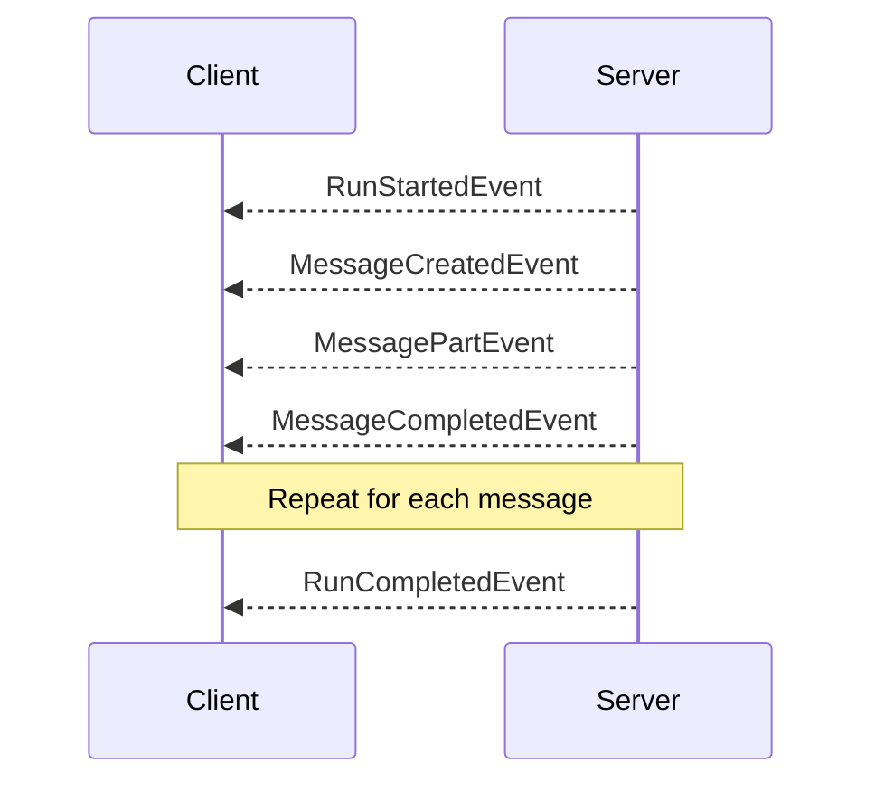

# Streaming Responses

Streaming enables real-time delivery of agent responses via Server-Sent Events (SSE). This provides a better user experience for long-running operations.

## Why Streaming?

- **Immediate Feedback**: Users see responses as they're generated
- **Progress Visibility**: Track long operations in real-time
- **Resource Efficiency**: Process data incrementally
- **Better UX**: No waiting for complete responses

## Basic Streaming

Return an `Enumerator` to enable streaming:

```ruby
server.agent("streamer") do |context|
  Enumerator.new do |yielder|
    5.times do |i|
      yielder << SimpleAcp::Server::RunYield.new(
        SimpleAcp::Models::Message.agent("Message #{i + 1}")
      )
      sleep 0.5
    end
  end
end
```

## RunYield

`RunYield` wraps messages for streaming:

```ruby
# Single message
yielder << SimpleAcp::Server::RunYield.new(
  SimpleAcp::Models::Message.agent("Hello")
)

# Multiple messages
yielder << SimpleAcp::Server::RunYield.new(
  [
    SimpleAcp::Models::Message.agent("First"),
    SimpleAcp::Models::Message.agent("Second")
  ]
)
```

## Streaming Patterns

### Token-by-Token

Stream individual tokens for typing effect:

```ruby
server.agent("typer") do |context|
  text = context.input.first&.text_content || "Hello World"

  Enumerator.new do |yielder|
    text.chars.each do |char|
      yielder << SimpleAcp::Server::RunYield.new(
        SimpleAcp::Models::Message.agent(char)
      )
      sleep 0.05
    end
  end
end
```

### Word-by-Word

```ruby
server.agent("word-stream") do |context|
  text = context.input.first&.text_content || ""

  Enumerator.new do |yielder|
    text.split.each do |word|
      yielder << SimpleAcp::Server::RunYield.new(
        SimpleAcp::Models::Message.agent(word + " ")
      )
      sleep 0.1
    end
  end
end
```

### Progress Updates

```ruby
server.agent("processor") do |context|
  items = parse_items(context.input)
  total = items.length

  Enumerator.new do |yielder|
    items.each_with_index do |item, i|
      # Process item
      result = process(item)

      # Report progress
      yielder << SimpleAcp::Server::RunYield.new(
        SimpleAcp::Models::Message.agent(
          "Processing #{i + 1}/#{total}: #{result}"
        )
      )
    end

    yielder << SimpleAcp::Server::RunYield.new(
      SimpleAcp::Models::Message.agent("Complete!")
    )
  end
end
```

### LLM Integration

Stream responses from language models:

```ruby
server.agent("chat") do |context|
  messages = context.history + context.input

  Enumerator.new do |yielder|
    llm.stream_chat(messages) do |chunk|
      yielder << SimpleAcp::Server::RunYield.new(
        SimpleAcp::Models::Message.agent(chunk)
      )
    end
  end
end
```

### Mixed Content

Stream different content types:

```ruby
server.agent("analyzer") do |context|
  data = parse_data(context.input)

  Enumerator.new do |yielder|
    # Text update
    yielder << SimpleAcp::Server::RunYield.new(
      SimpleAcp::Models::Message.agent("Analyzing data...")
    )

    result = analyze(data)

    # JSON result
    yielder << SimpleAcp::Server::RunYield.new(
      SimpleAcp::Models::Message.agent(
        SimpleAcp::Models::MessagePart.json(result)
      )
    )

    # Summary text
    yielder << SimpleAcp::Server::RunYield.new(
      SimpleAcp::Models::Message.agent("Analysis complete!")
    )
  end
end
```

## Event Types

Streaming produces these events:



## HTTP Streaming

The server uses SSE for HTTP streaming:

```
POST /runs HTTP/1.1
Accept: text/event-stream
Content-Type: application/json

{"agent_name": "chat", "input": [...]}

HTTP/1.1 200 OK
Content-Type: text/event-stream

event: run_started
data: {"run_id":"abc123"}

event: message_created
data: {"message":{"role":"agent","parts":[]}}

event: message_part
data: {"part":{"content_type":"text/plain","content":"Hello"}}

event: message_completed
data: {"message":{"role":"agent","parts":[...]}}

event: run_completed
data: {"run":{...}}
```

## Server-Side Streaming

Execute streaming runs programmatically:

```ruby
server.run_stream(
  agent_name: "chat",
  input: messages
) do |event|
  case event
  when SimpleAcp::Models::MessagePartEvent
    print event.part.content
  when SimpleAcp::Models::RunCompletedEvent
    puts "\nDone!"
  end
end
```

## Error Handling

Handle errors during streaming:

```ruby
server.agent("safe-streamer") do |context|
  Enumerator.new do |yielder|
    begin
      process_stream(context.input) do |chunk|
        yielder << SimpleAcp::Server::RunYield.new(
          SimpleAcp::Models::Message.agent(chunk)
        )
      end
    rescue StreamError => e
      yielder << SimpleAcp::Server::RunYield.new(
        SimpleAcp::Models::Message.agent("Stream error: #{e.message}")
      )
    end
  end
end
```

## Buffering

For high-frequency updates, consider buffering:

```ruby
server.agent("buffered") do |context|
  Enumerator.new do |yielder|
    buffer = []

    process_items(context.input) do |item|
      buffer << item

      # Flush every 10 items
      if buffer.length >= 10
        yielder << SimpleAcp::Server::RunYield.new(
          SimpleAcp::Models::Message.agent(buffer.join)
        )
        buffer.clear
      end
    end

    # Flush remaining
    unless buffer.empty?
      yielder << SimpleAcp::Server::RunYield.new(
        SimpleAcp::Models::Message.agent(buffer.join)
      )
    end
  end
end
```

## Best Practices

1. **Yield frequently** - Don't wait too long between yields
2. **Handle errors** - Catch and report errors gracefully
3. **Use appropriate chunking** - Balance frequency with overhead
4. **Test streaming** - Verify event order and content
5. **Monitor memory** - Stream large responses to avoid memory issues

## Testing Streaming

```ruby
def test_streaming_agent
  events = []

  server.run_stream(
    agent_name: "streamer",
    input: [SimpleAcp::Models::Message.user("test")]
  ) do |event|
    events << event
  end

  # Verify event sequence
  assert events.first.is_a?(SimpleAcp::Models::RunStartedEvent)
  assert events.last.is_a?(SimpleAcp::Models::RunCompletedEvent)

  # Check message events
  message_events = events.select { |e| e.is_a?(SimpleAcp::Models::MessagePartEvent) }
  assert message_events.length > 0
end
```

## Next Steps

- Learn about [Multi-Turn Conversations](multi-turn.md)
- See [Client Streaming](../client/streaming.md) for consuming streams
- Review [Events](../core-concepts/events.md) for event details
